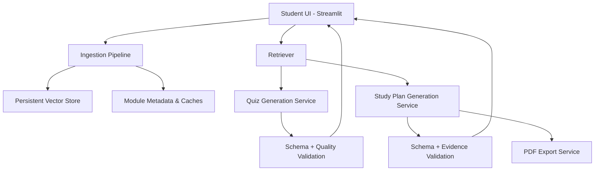
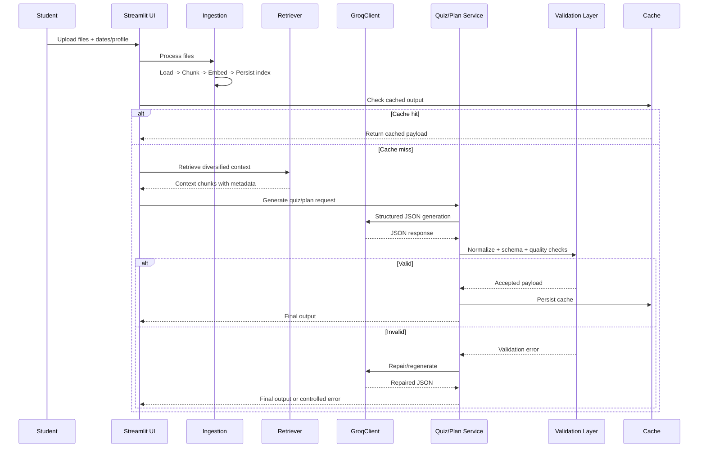

# PrepPilot Architecture

Technical architecture reference for PrepPilot.

This document explains how the system is built, how LangChain + RAG are implemented, and how reliability/caching/grounding are enforced.

---

## 1) Architecture Goals

- Ground every generated output in uploaded module content
- Keep inference cost low with local embeddings + caching
- Handle Groq rate limits and model errors gracefully
- Provide deterministic, testable behavior for quiz and study-plan flows

---

## 2) High-Level System Diagram

---

## 3) Core Modules

### Entry + UI
- `app.py`
- `exam_helper/ui/styles.py`
- `exam_helper/ui/components.py`

Responsibilities:
- upload and date/profile inputs
- orchestration of ingestion/retrieval/generation
- tab rendering (`Live Quiz`, `Study Plan`)
- session state and generation guards

### Ingestion
- `exam_helper/ingestion/loaders.py`
- `exam_helper/ingestion/chunking.py`
- `exam_helper/ingestion/index_store.py`

Responsibilities:
- read PDFs via `PyPDFLoader`
- read PPTX slides via `python-pptx`
- normalize metadata
- chunk documents with overlap
- embed and persist vector index

### Retrieval
- `exam_helper/retrieval/retriever.py`

Responsibilities:
- multi-intent query expansion
- MMR retrieval
- page/slide diversity caps
- optional large-module TF-IDF prefiltering
- context packaging for prompts

### Generation + Quality
- `exam_helper/services/groq_client.py`
- `exam_helper/services/quiz_service.py`
- `exam_helper/services/study_plan_service.py`
- `exam_helper/services/quality_guard.py`
- `exam_helper/services/relevance_filter.py`
- `exam_helper/services/topic_service.py`
- `exam_helper/services/pdf_export.py`

Responsibilities:
- Groq API calls with retry/fallback
- strict JSON generation
- output normalization and validation
- anti-duplication and anti-template quiz filtering
- content relevance filtering (remove admin/logistics content)
- study plan PDF rendering

### Shared Utilities
- `exam_helper/models.py` (Pydantic contracts)
- `exam_helper/utils/cache.py` (JSON cache helpers)
- `exam_helper/utils/hash.py` (module identity)
- `exam_helper/utils/guards.py` (UI guard logic)
- `exam_helper/config.py` (runtime defaults/configuration)

---

## 4) LangChain + RAG Implementation

### LangChain RAG Pipeline Diagram

### Step A: Load Documents

1. User uploads files.
2. Files are saved under module-scoped directory.
3. Load into LangChain `Document` objects:
   - PDF pages (`PyPDFLoader`)
   - PPTX slides (`python-pptx` -> `Document`)

Metadata included:
- `source_file`
- `source_type`
- `page_or_slide_number`

### Step B: Chunk

- `RecursiveCharacterTextSplitter`
- Config:
  - `chunk_size=1200`
  - `chunk_overlap=200`
  - newline/paragraph-priority separators

Chunk metadata enrichment:
- `chunk_id`
- `snippet_reference`
- inherited source metadata

### Step C: Embed + Index

- Local embeddings with `HuggingFaceEmbeddings`
- Model: `sentence-transformers/all-MiniLM-L6-v2`
- Vector store persistence:
  - primary: `Chroma`
  - fallback: `SKLearnVectorStore`

### Step D: Retrieve

- Query expansion across multiple intents:
  - overview
  - definitions
  - comparisons
  - applications
  - topic-specific prompts
- Retriever mode: MMR (`search_type="mmr"`)
- Diversity controls:
  - cap repeated chunks from same page/slide
  - dedupe by `chunk_id`
- Optional TF-IDF side index for very large modules

### Step E: Grounded Generation

- Only retrieved context is sent to LLM
- Strict JSON schema requested
- Pydantic validation + normalization + repair pass
- If quality or grounding fails, regenerate/repair/fallback logic executes

---

## 5) Detailed Sequence Diagram

---

## 6) Caching Strategy

Module identity:
- deterministic SHA-256 based hash of uploaded file bytes + names

Storage root:
- `.exam_helper_data/modules/{module_id}/`

Cached artifacts:
- processed chunks
- persisted vector store
- quiz cache (`quiz_cache.json`)
- study plan cache (`plan_cache.json`)
- relevance labels/overrides
- module manifest

Cache keys include:
- module id
- schema version
- task type (quiz/plan)
- dates/profile inputs
- model route
- retrieval depth
- relevance override hash

---

## 7) Model Routing, Retry, and Fallback

Groq client:
- OpenAI-compatible endpoint
- configurable base URL and timeout

Retry handling:
- detect HTTP `429`
- parse `Retry-After` (seconds/date)
- fallback to exponential backoff + jitter when missing

Model fallback:
- tries preferred model first
- then configured fallback chain
- surfaces controlled error if all attempts fail

---

## 8) Quality and Safety Controls

### Quiz
- exactly 15 validated MCQs
- deduplication on question stems
- reject template-like/low-quality outputs
- citation requirement per question
- topic spread enforcement

### Study Plan
- required section completeness checks
- detailed content normalization for weak outputs
- citation checks for important claims/questions
- evidence quality scoring metadata (internal)

### Relevance Filtering
- chunk labeling:
  - `core_exam_content`
  - `admin_meta`
  - `uncertain`
- retrieval defaults to exam-relevant chunks
- admin/logistics noise suppressed by default

---

## 9) Data Contracts

Defined in `exam_helper/models.py`:
- `QuizQuestion`
- `QuizSet`
- `StudyPlan`
- citation and study-profile models

These contracts enforce structural correctness for UI rendering and downstream processing.

---

## 10) Operational Notes

- Recommended Python: **3.12/3.13**
- Local development supports Python 3.11 through 3.14
- First run is slower (embedding/index build); repeat runs are much faster due to persistence/caching
- For local validation:
  - `python -m ruff check .`
  - `python -m pytest`
  - `python -m compileall app.py exam_helper`

---

## 11) Future Improvements (Optional)

- Background ingestion queue for very large uploads
- Incremental indexing for edited modules
- Hybrid lexical + vector retrieval re-ranking
- Observability metrics dashboard (latency/cache hit/retry counts)
- Multi-module comparison mode
