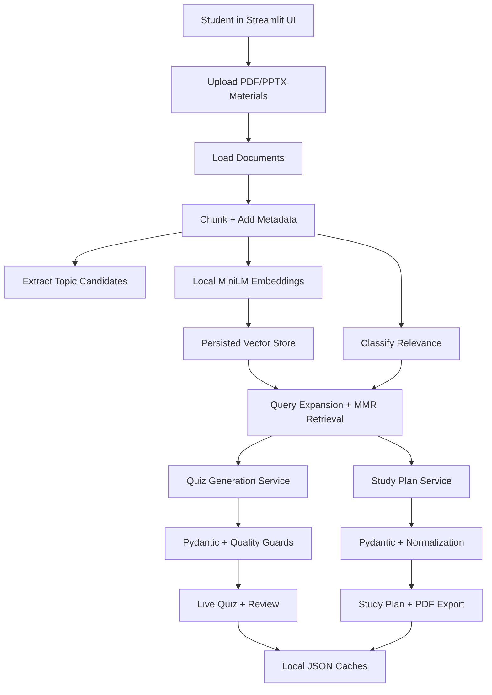

# PrepPilot - AI Study Companion

PrepPilot is a local Streamlit application that turns a student's own lecture
PDFs and PowerPoint decks into grounded exam revision assets:

- a 15-question multiple-choice quiz;
- a personalized day-by-day study plan;
- a downloadable study-plan PDF.

The project is designed around a practical constraint that most study tools
miss: students do not need another generic chatbot. They need revision help
anchored to their actual module material, traceable references, and a realistic
plan for the time they have before an exam.

## What It Does

- Ingests `.pdf` and `.pptx` lecture materials.
- Builds a local retrieval index with LangChain, MiniLM embeddings, Chroma, and
  an SKLearn fallback.
- Filters admin/logistics content so study outputs focus on exam material.
- Generates exactly 15 grounded MCQs with difficulty control, explanations,
  topic coverage, scoring, and citations.
- Generates a personalized study plan from the chosen start date to exam date.
- Factors in study hours, preferred study window, and topic confidence.
- Exports the study plan as a downloadable PDF.
- Caches processed modules, quiz outputs, and plan outputs for faster reuse.

## Why This Matters

PrepPilot demonstrates the engineering work behind a useful AI product, not
just a prompt wrapped in a UI:

- **Grounding:** outputs are tied to retrieved chunks and shown with file and
  page-or-slide references.
- **Reliability:** Pydantic contracts enforce quiz and study-plan shape before
  rendering.
- **Retrieval quality:** query expansion, MMR retrieval, diversity caps, and
  TF-IDF support improve context selection.
- **User fit:** the UI follows the real workflow: upload, choose dates,
  practise, review, and export a plan.
- **Operational discipline:** linting, tests, CI, cache schema versioning,
  upload sanitization, and secret handling are present.

## Core Features

### Live Quiz

- Exactly 15 multiple-choice questions per generated quiz.
- Difficulty modes: `Easy`, `Medium`, and `Hard`.
- Topic coverage summary for the generated question set.
- Four-option answer format enforced by Pydantic.
- Detailed feedback with correct answer, user answer, explanation, topic tag,
  and citations.
- Duplicate/template filtering and refill/repair passes for weak model output.
- Optional regeneration to bypass cached quiz results.

### Study Plan

- Date-aware plan from `today` through `exam_date`, inclusive.
- Prioritized topics with `High`, `Medium`, and `Low` labels.
- Daily schedule with concrete methods and timeboxes.
- Study tactics tailored to the module and student profile.
- Important practice questions with `MCQ`, `ShortAnswer`, `Conceptual`, and
  `Application` types.
- Evidence quality metadata used by the UI to warn when grounding is weak.
- PDF export via ReportLab.

### Retrieval and Grounding

- Uploads are stored under a deterministic hash of file names and bytes.
- PDFs use `PyPDFLoader`; modern PowerPoint decks use `python-pptx`.
- Documents are split with `RecursiveCharacterTextSplitter`.
- Chunk settings are `chunk_size=1200` and `chunk_overlap=200`.
- Embeddings run locally with `sentence-transformers/all-MiniLM-L6-v2`.
- Chroma is primary; SKLearnVectorStore is the fallback.
- Retrieval expands queries across overview, definitions, comparisons,
  applications, and extracted topics.
- Retrieved context is diversified across source pages/slides and chunk ids.
- Relevance labels are `core_exam_content`, `admin_meta`, or `uncertain`.

## Architecture



### Main Components

`app.py`, `exam_helper/ui/*`

: Streamlit layout, sidebar workflow, tabs, session state, quiz review, and
plan rendering.

`exam_helper/config.py`

: Runtime defaults, model names, data paths, cache schema, and supported
extensions.

`exam_helper/ingestion/*`

: File saving, path-safe upload names, PDF/PPTX loading, chunking, and vector
store creation.

`exam_helper/retrieval/retriever.py`

: Query expansion, MMR retrieval, diversity caps, and TF-IDF large-module
support.

`exam_helper/services/quiz_service.py`

: Quiz prompt construction, structured JSON generation, normalization,
deduplication, refill behavior, and repair behavior.

`exam_helper/services/study_plan_service.py`

: Study-plan prompt construction, date normalization, evidence checks, and
schema repair behavior.

`exam_helper/services/groq_client.py`

: OpenAI-compatible Groq calls, JSON extraction, retry-after handling, and
model fallback.

`exam_helper/services/quality_guard.py`

`exam_helper/services/relevance_filter.py`

: Duplicate detection, low-quality question filtering, admin-content filtering,
and grounding warnings.

`exam_helper/models.py`

: Pydantic models for citations, quizzes, student profile, and study plans.

`tests/*`

: Model validation, upload guards, environment fallback behavior, and Groq JSON
parsing.

For deeper implementation notes, see [ARCHITECTURE.md](ARCHITECTURE.md).

## Tech Stack

- **Application:** Python, Streamlit
- **LLM provider:** Groq through an OpenAI-compatible client
- **Retrieval:** LangChain, Chroma, SKLearnVectorStore fallback
- **Embeddings:** `sentence-transformers/all-MiniLM-L6-v2` on local CPU
- **Document parsing:** `pypdf`, `python-pptx`
- **Validation:** Pydantic v2
- **PDF generation:** ReportLab
- **Testing and linting:** pytest, Ruff
- **CI:** GitHub Actions on Python 3.12 and 3.13

## Quick Start

### Prerequisites

- Python `>=3.11,<3.15`
- A Groq API key
- Local shell access for installing Python dependencies

### 1. Create a Virtual Environment

```powershell
python -m venv .venv
.\.venv\Scripts\Activate.ps1
python -m pip install --upgrade pip
```

### 2. Install Dependencies

```powershell
python -m pip install -r requirements.txt
```

The first run may download the local embedding model used by
`sentence-transformers`.

### 3. Configure Environment Variables

Copy the example file and fill in your API key:

```powershell
Copy-Item .env.example .env
```

```env
GROQ_API_KEY_1=your_groq_api_key
GROQ_BASE_URL=https://api.groq.com/openai/v1

PRIMARY_MODEL=llama-3.1-8b-instant
FALLBACK_MODEL_1=openai/gpt-oss-20b

LLM_TIMEOUT_SECONDS=30
MAX_RETRIES=1
```

The app also checks Streamlit secrets for `GROQ_API_KEY_1` or `GROQ_API_KEY`,
then falls back to environment variables.

### 4. Run the App

```powershell
python -m streamlit run app.py
```

Then use the sidebar workflow:

1. Upload one or more `.pdf` or `.pptx` files.
2. Choose start and exam dates.
3. Set available study hours and preferred study window.
4. Click `Start and Analyze My Materials`.
5. Generate a quiz or study plan from the two main tabs.

## Environment Variables

- `GROQ_API_KEY_1`: required primary Groq API key.
- `GROQ_API_KEY`: optional secondary key name supported by the app.
- `GROQ_BASE_URL`: optional API base URL.
  Default: `https://api.groq.com/openai/v1`.
- `PRIMARY_MODEL`: optional quiz model.
  Default: `llama-3.1-8b-instant`.
- `FALLBACK_MODEL_1`: optional plan model and fallback model.
  Default: `openai/gpt-oss-20b`.
- `LLM_TIMEOUT_SECONDS`: optional OpenAI client timeout.
  Default: `30`.
- `MAX_RETRIES`: optional per-model retry count for rate-limited calls.
  Default: `1`.

## Scripts and Commands

This repo uses direct Python module commands instead of a custom task runner.

- `python -m streamlit run app.py`: start the local app.
- `python -m ruff check .`: run lint checks.
- `python -m pytest`: run the test suite.
- `python -m compileall app.py exam_helper`: compile application modules and
  catch syntax errors.

## Testing and CI

The test suite currently covers:

- Pydantic quiz validation, including the exact 15-question requirement.
- Upload filename sanitization and unsupported extension rejection.
- Generation guards for unprocessed materials, invalid dates, and missing keys.
- Groq JSON extraction from wrapped model output.
- Environment variable fallback behavior for invalid numeric config values.

GitHub Actions runs:

- `python -m ruff check .`
- `python -m pytest`

The CI matrix uses Python 3.12 and 3.13.

## Security and Privacy Notes

- `.env` is ignored by git; use `.env.example` as the template.
- Local app data is written under `.exam_helper_data/`.
- `.exam_helper_data/` is ignored by git.
- Uploaded files are saved locally inside module-scoped cache directories.
- Upload names are sanitized to prevent path traversal.
- Unsupported file extensions are rejected.
- Retrieved text chunks are sent to the configured Groq-compatible API.
- API keys should never be committed or stored in uploaded study files.

## Project Structure

```text
.
|-- app.py
|-- ARCHITECTURE.md
|-- README.md
|-- pyproject.toml
|-- requirements.txt
|-- .env.example
|-- .github/
|   `-- workflows/
|       `-- ci.yml
|-- exam_helper/
|   |-- config.py
|   |-- models.py
|   |-- ingestion/
|   |-- retrieval/
|   |-- services/
|   |-- ui/
|   `-- utils/
`-- tests/
    |-- test_config.py
    |-- test_groq_client.py
    |-- test_guards.py
    |-- test_loaders.py
    `-- test_models.py
```

## Troubleshooting

### `Process files` or generation is disabled

Make sure materials have been uploaded and processed. The exam date must not
be earlier than the start date. A Groq key must be available through Streamlit
secrets or environment variables.

### First run is slow

The first processing run builds embeddings, vector indexes, chunk caches, and
topic metadata. Repeat runs for the same uploaded files should be faster
because module artifacts are cached under `.exam_helper_data/`.

### Chroma fails to initialize

The vector store layer attempts to use Chroma first. If Chroma is unavailable
or fails during index creation/loading, the code falls back to LangChain's
`SKLearnVectorStore`.

### Model output is invalid or incomplete

The quiz and study-plan services normalize and validate model output. Quiz
generation includes candidate filtering, deduplication, refill attempts,
fallback model attempts, and a repair pass. If quality remains too low, the UI
surfaces a controlled error and the user can regenerate.

### Legacy `.ppt` files do not upload

Only modern `.pptx` files are supported. Convert older PowerPoint files to
`.pptx` before uploading.

## Roadmap and Known Limitations

- No hosted deployment is included in this repository.
- Only `.pdf` and `.pptx` uploads are supported.
- OCR is not implemented, so scanned PDFs without extractable text may produce
  weak or empty results.
- Retrieval and generation depend on uploaded material quality and the
  configured Groq-compatible model.
- The app currently runs generation synchronously inside Streamlit.
- Potential future improvements include background ingestion, incremental
  indexing, hybrid re-ranking, observability metrics, and multi-module
  comparison.

## Development Principles Shown Here

PrepPilot is a compact example of production-minded AI application design:

- keep private study material local except retrieved text sent to the LLM
  provider;
- separate ingestion, retrieval, generation, quality checks, and UI rendering;
- validate model output before trusting it;
- design cache keys around inputs that affect generated results;
- treat AI output quality as an engineering problem with tests, schemas, repair
  paths, and explicit fallback behavior.
