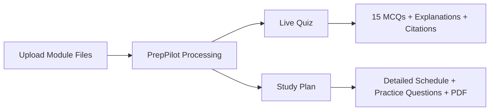

# PrepPilot - AI Study Companion

PrepPilot is an AI study companion that turns your lecture material into:
- a high-quality live quiz session (exactly 15 MCQs), and
- a clear, day-by-day study plan you can download as PDF.

Built for students who want focused revision from their own module files, not generic answers.

---

## Why PrepPilot

- Study from **your uploaded content** (`.pdf`, `.pptx`)
- Get **detailed explanations** for quiz answers
- Get a **structured study plan** from today to exam date
- Keep everything **grounded with citations** (file + page/slide)

---

## What You Get

### Live Quiz
- Exactly **15 MCQs** per session
- Difficulty levels: Easy / Medium / Hard
- Detailed answer explanations
- Per-question citations
- Score + review mode after submit

### Study Plan
- Prioritized topics (High / Medium / Low)
- Complete day-by-day schedule (today to exam)
- Study tactics tailored to your module
- Important practice questions
- One-click **PDF export**

---

## System Diagram



---

## Quick Start

### 1) Install dependencies

```powershell
python -m venv .venv
.\.venv\Scripts\Activate.ps1
python -m pip install -r requirements.txt
```

### 2) Configure environment

Copy `.env.example` to `.env` and set:

```env
GROQ_API_KEY_1=your_groq_key
GROQ_BASE_URL=https://api.groq.com/openai/v1

PRIMARY_MODEL=llama-3.1-8b-instant
FALLBACK_MODEL_1=openai/gpt-oss-20b

LLM_TIMEOUT_SECONDS=30
MAX_RETRIES=1
```

### 3) Run the app

```powershell
python -m streamlit run app.py
```

### 4) Validate changes

```powershell
python -m ruff check .
python -m pytest
python -m compileall app.py exam_helper
```

---

## Typical Student Flow

1. Upload your module files
2. Set today's date and exam date
3. Set your study profile (hours/day, preferred study window, topic confidence)
4. Generate quiz and study plan
5. Download study plan as PDF

---

## Feature Highlights

- Student-first UI (only two tabs: `Live Quiz`, `Study Plan`)
- Strong quality controls to avoid duplicate or weak quiz questions
- Admin/logistics content filtering (e.g., Canvas/policy noise) to focus on exam material
- Local caching and persistent indexing for fast repeat usage
- Robust Groq retry + fallback behavior on rate limits
- Path-safe upload handling for local module files

---

## Tech Notes (Short)

- Frontend: Streamlit
- Supported uploads: PDF and modern PowerPoint (`.pptx`)
- LLM: Groq (OpenAI-compatible API)
- Retrieval pipeline: LangChain-based RAG
- Embeddings: Local (`all-MiniLM-L6-v2`)
- Vector store: Chroma (with SKLearn fallback)
- Quality checks: Ruff, pytest, and GitHub Actions CI

For full technical architecture, read **[`ARCHITECTURE.md`](ARCHITECTURE.md)**.

---


